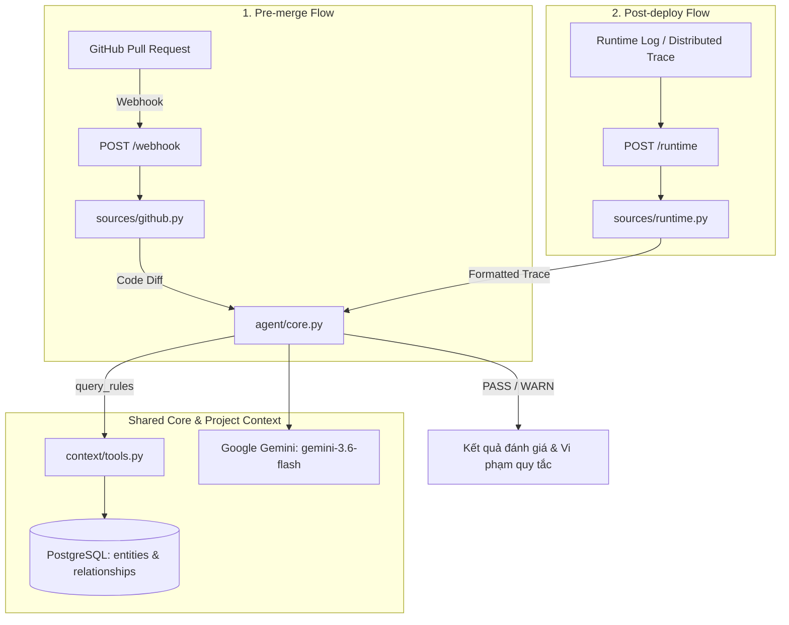

# AI Agent Đảm Bảo Chất Lượng Phần Mềm (Software Quality AI Agent)

Hệ thống AI Agent tự động giám sát và bảo đảm chất lượng phần mềm hoạt động trên **HAI luồng** (Pre-merge và Post-deploy), dùng chung một **Project Context (PostgreSQL)** và một **Agent Core (Gemini)**.

---

## 🏗 Kiến Trúc Hệ Thống



### Hai luồng nghiệp vụ:
1. **Pre-merge (`POST /webhook`)**:
   - Lắng nghe sự kiện Pull Request từ GitHub webhook (`opened`, `synchronize`).
   - Lấy code diff qua GitHub API.
   - Agent đối chiếu diff với các quy tắc nghiệp vụ trong Project Context để phát hiện lỗi logic nghiệp vụ trước khi code được merge.
   - Bỏ qua lỗi cú pháp/style (để CI/Linter xử lý).

2. **Post-deploy (`POST /runtime`)**:
   - Nhận log/trace thực tế từ ứng dụng đang chạy ở môi trường Staging/Production.
   - Agent đối chiếu thứ tự gọi hàm và hành vi thực tế với quy tắc nghiệp vụ và thiết kế.
   - Phát hiện các trường hợp chạy thiếu bước, sai thứ tự hoặc vi phạm logic bắt buộc (ví dụ: chuyển tiền không qua KYC, trừ tiền không bắn event).

---

## 📁 Cấu Trúc Thư Mục

```text
agent-review/
├── .env.example          # File mẫu biến môi trường
├── .gitignore            # Loại trừ git cache, venv, .env
├── requirements.txt      # Khai báo thư viện phụ thuộc
├── config.py             # Quản lý cấu hình & biến môi trường
├── app.py                # Điểm vào ứng dụng Flask (chứa 2 routes /webhook và /runtime)
├── context/
│   ├── __init__.py
│   ├── db.py             # Kết nối PostgreSQL (psycopg2)
│   └── tools.py          # Tool query_rules truy vấn Project Context
├── agent/
│   ├── __init__.py
│   ├── prompt.py         # System prompts (PROMPT_PRE_MERGE, PROMPT_POST_DEPLOY)
│   └── core.py           # Vòng lặp Agent core xử lý tool calls với Gemini
├── sources/
│   ├── __init__.py
│   ├── github.py         # Gọi GitHub API lấy PR diff
│   └── runtime.py        # Chuẩn hóa runtime log/trace
├── db/
│   └── seed.sql          # Schema và seed data cho entities & relationships
└── README.md
```

---

## 🚀 Hướng Dẫn Cài Đặt & Triển Khai

### 1. Chuẩn bị môi trường Python

Khởi tạo virtual environment và cài đặt dependencies:

```bash
# Tạo môi trường ảo
python -m venv venv

# Kích hoạt môi trường ảo
# Trên Windows:
.\venv\Scripts\activate
# Trên Linux/macOS:
source venv/bin/activate

# Cài đặt thư viện
pip install -r requirements.txt
```

### 2. Cấu hình biến môi trường

Tạo file `.env` từ `.env.example`:

```bash
cp .env.example .env
```

Chỉnh sửa nội dung file `.env`:
```env
GEMINI_API_KEY=AIzaSy...your_gemini_api_key...
GITHUB_TOKEN=ghp_...your_github_personal_access_token...
DB_HOST=localhost
DB_PORT=5433
DB_NAME=context
DB_USER=postgres
DB_PASSWORD=devpass
```

---

### 3. Chạy PostgreSQL bằng Docker & Nạp Seed Data

Khởi động container PostgreSQL trên cổng `5433`:

```bash
docker run --name pg-context \
  -e POSTGRES_DB=context \
  -e POSTGRES_USER=postgres \
  -e POSTGRES_PASSWORD=devpass \
  -p 5433:5432 \
  -d postgres:16-alpine
```

Nạp schema và dữ liệu mẫu từ `db/seed.sql`:

```bash
# Sử dụng docker exec để nạp seed.sql trực tiếp vào container
docker exec -i pg-context psql -U postgres -d context < db/seed.sql
```

Kiểm tra dữ liệu đã nạp:
```bash
docker exec -it pg-context psql -U postgres -d context -c "SELECT * FROM entities;"
```

---

### 4. Khởi Chạy Ứng Dụng Flask

Chạy máy chủ ứng dụng trên cổng `8000`:

```bash
python app.py
```

Server sẽ lắng nghe tại `http://0.0.0.0:8000`.

---

### 5. Nối Webhook Qua Tunnel (Ví dụ: ngrok hoặc Cloudflare Tunnel)

Để GitHub gửi được Webhook về máy local của bạn:

```bash
# Sử dụng ngrok
ngrok http 8000

# Hoặc dùng Cloudflare Tunnel (cloudflared)
cloudflared tunnel --url http://localhost:8000
```

Sau đó, vào GitHub Repository:
- **Settings** > **Webhooks** > **Add webhook**
- **Payload URL**: `https://<your-tunnel-domain>/webhook`
- **Content type**: `application/json`
- **Which events would you like to trigger this webhook?**: Chọn **Let me select individual events** -> Tích vào **Pull requests**.

---

## 🧪 Hướng Dẫn Kiểm Thử Nhanh

### Test Luồng 1: Pre-merge (`POST /webhook`)

Mô phỏng sự kiện Webhook từ GitHub khi có PR mở mới:

```bash
curl -X POST http://localhost:8000/webhook \
  -H "Content-Type: application/json" \
  -d '{
    "action": "opened",
    "pull_request": {
      "number": 1,
      "title": "Cập nhật hàm transfer bỏ qua xác thực"
    },
    "repository": {
      "full_name": "octocat/Hello-World"
    }
  }'
```

### Test Luồng 2: Post-deploy (`POST /runtime`)

Gửi log chuỗi gọi hàm khi thực hiện chuyển tiền 100 triệu nhưng thiếu bước phát tán event:

```bash
curl -X POST http://localhost:8000/runtime \
  -H "Content-Type: application/json" \
  -d '{
    "log": "2026-09-18 10:00:01 INFO [transfer] Bắt đầu giao dịch chuyển 100,000,000 VND\n2026-09-18 10:00:02 INFO [transfer] Đã trừ tiền tài khoản nguồn thành công\n2026-09-18 10:00:03 INFO [transfer] Kết thúc giao dịch không phát sinh event"
  }'
```

Agent sẽ:
1. Gọi `query_rules(function_name='transfer')`.
2. Truy vấn từ Postgres thấy quy tắc:
   - `R-023`: "Chuyển tiền > 50 triệu phải xác thực KYC bậc 2"
   - `R-045`: "Sau khi trừ tiền phải publish sự kiện để đối soát"
3. Đối chiếu và đưa ra cảnh báo **WARN** vì thiếu xác thực KYC và không có bước `publish` sự kiện đối soát sau khi trừ tiền!
