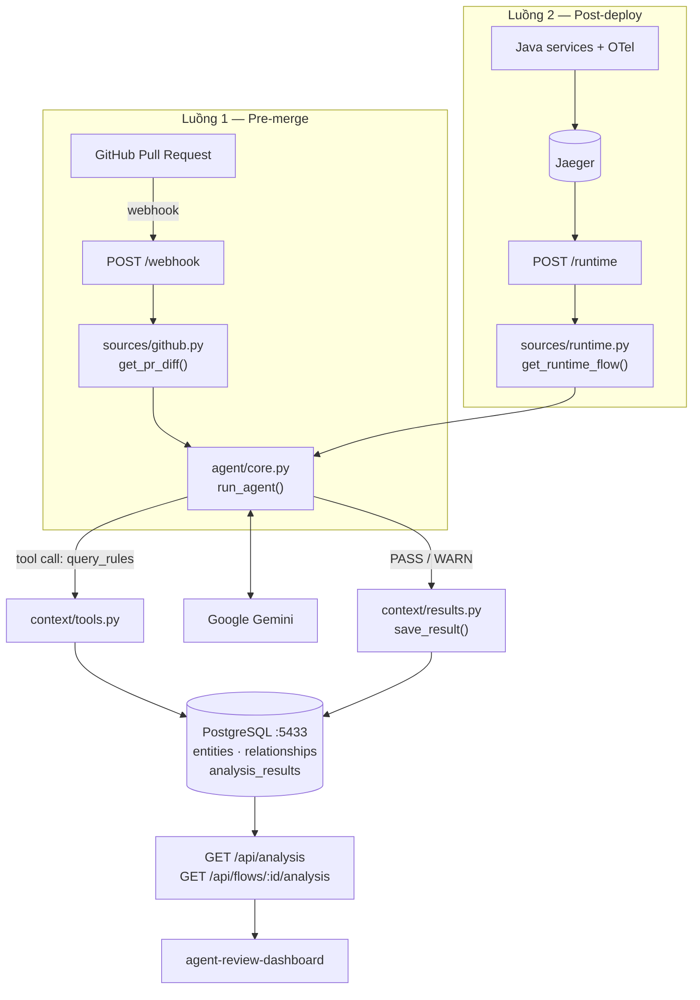

# agent-review — AI Agent đảm bảo chất lượng phần mềm

Backend Flask chạy **AI Agent** đối chiếu code và hành vi runtime với **quy tắc nghiệp vụ / tài liệu thiết kế**,
rồi kết luận `PASS` / `WARN`. Agent hoạt động trên hai luồng, dùng chung một Project Context (PostgreSQL)
và một Agent Core (Google Gemini).

| | Luồng 1 — Pre-merge | Luồng 2 — Post-deploy |
|---|---|---|
| Kích hoạt | GitHub webhook khi có Pull Request | Gọi thủ công / định kỳ sau khi deploy |
| Endpoint | `POST /webhook` | `POST /runtime` |
| Đầu vào | Code diff của PR (GitHub API) | Trace từ Jaeger, hoặc raw log |
| Đối chiếu với | Business rule trong Project Context | Tài liệu thiết kế flow (`DESIGN_F1`) + NFR |
| Đầu ra | JSON trả về cho caller | JSON **và** lưu vào bảng `analysis_results` |

Kết quả của Luồng 2 được [agent-review-dashboard](https://github.com/talent-vds-global/agent-review-dashboard)
đọc lên qua `GET /api/analysis` và `GET /api/flows/<flow_id>/analysis`.

---

## 1. Kiến trúc



### Cách agent suy luận

`agent/core.py` tự điều khiển vòng lặp tool-call (đã **tắt** `automatic_function_calling` của SDK) để
kiểm soát và log được từng bước:

1. Gửi `system_prompt` + dữ liệu đầu vào cho Gemini, kèm khai báo tool `query_rules`.
2. Nếu model yêu cầu gọi tool → thực thi tool trong `AVAILABLE_TOOLS`, trả kết quả về cho model.
3. Lặp tối đa `max_turns = 8` lượt cho tới khi model đưa ra kết luận văn bản.
4. Lỗi tạm thời từ Gemini (`503` quá tải, `429` rate limit) được retry với exponential backoff 1s → 2s → 4s…
   Các lỗi khác (sai API key, sai tham số) ném ra ngay vì thử lại cũng vô ích.

Verdict được tách từ **dòng đầu tiên** của kết luận: có chữ `WARN` → `WARN`, có `PASS` → `PASS`,
còn lại → `UNKNOWN`. Vì vậy prompt bắt buộc model mở đầu bằng đúng một từ trên dòng đầu.

---

## 2. Cấu trúc thư mục

```text
agent-review/
├── app.py                    # Flask app: 2 webhook + 2 API cho dashboard
├── config.py                 # Đọc .env → hằng số cấu hình
├── requirements.txt
├── Dockerfile
├── docker-compose.yml        # postgres + app
├── .env.example
│
├── agent/
│   ├── core.py               # run_agent(): vòng lặp tool-call + retry
│   └── prompt.py             # PROMPT_PRE_MERGE, PROMPT_POST_DEPLOY, DESIGN_F1
│
├── context/                  # Project Context (PostgreSQL)
│   ├── db.py                 # get_db_connection()
│   ├── tools.py              # query_rules() — tool agent gọi được
│   └── results.py            # save_result(), get_latest_flow_result(), list_analysis_results()
│
├── sources/                  # Các nguồn dữ liệu đầu vào
│   ├── github.py             # get_pr_diff() — GitHub API
│   ├── runtime.py            # get_runtime_flow(), get_latest_trace_id(), parse_log() — Jaeger API
│   ├── confluence.py         # get_page_content() — Confluence Cloud API v2
│   └── bitbuckit.py          # (chưa triển khai)
│
├── db/
│   ├── seed.sql              # entities + relationships + dữ liệu mẫu
│   └── analysis_table.sql    # bảng analysis_results
│
└── test_*.py                 # Script thử tay từng phần (không phải pytest)
```

---

## 3. Mô hình dữ liệu

### Project Context — `entities` + `relationships` (`db/seed.sql`)

Knowledge graph tối giản: mọi thứ là **entity** (`function` / `flow` / `rule`), nối nhau bằng
**relationship** có hướng.

```text
function ──belongs_to──▶ flow ──must_follow──▶ rule
```

Dữ liệu mẫu đang có:

| Entity | Type | Nội dung |
|---|---|---|
| `transfer` | function | Trừ tiền và điều chuyển số dư tài khoản |
| `publish` | function | Phát tán event thông báo giao dịch lên Message Broker |
| `deque` | function | Tiêu thụ tác vụ từ hàng đợi ngầm |
| `chuyen-tien` | flow | Luồng nghiệp vụ chuyển tiền trực tuyến |
| `R-023` | rule | Chuyển tiền > 50 triệu phải xác thực KYC bậc 2 |
| `R-045` | rule | Sau khi trừ tiền phải publish sự kiện để đối soát |

Tool `query_rules(function_name)` đi đúng hai cạnh này để trả về danh sách rule mà hàm phải tuân thủ.
Muốn agent biết thêm rule mới, thêm entity + relationship vào `db/seed.sql` rồi nạp lại.

### Kết quả phân tích — `analysis_results` (`db/analysis_table.sql`)

| Cột | Kiểu | Ý nghĩa |
|---|---|---|
| `id` | SERIAL PK | |
| `flow_id` | TEXT | Mã flow, vd `F1` |
| `analysis_type` | TEXT | `pre_merge` \| `post_deploy` |
| `verdict` | TEXT | `PASS` \| `WARN` \| `UNKNOWN` |
| `detail` | TEXT | Toàn văn kết luận của agent (Markdown) |
| `runtime_flow` | TEXT | Chuỗi các bước runtime đã lọc nhiễu |
| `created_at` | TIMESTAMP | Mặc định `NOW()` |

> Hiện **chỉ Luồng 2 (`/runtime`) ghi vào bảng này**. Luồng 1 mới trả JSON, chưa lưu DB.

---

## 4. Cài đặt

### Yêu cầu

- Python 3.11+
- Docker (cho PostgreSQL)
- Gemini API key — lấy ở [Google AI Studio](https://aistudio.google.com/apikey)
- GitHub Personal Access Token (chỉ cần cho Luồng 1; scope `repo` nếu repo private)
- Jaeger đang chạy (chỉ cần cho Luồng 2) — xem `ewallet-demo/docker-compose.yml`

### 4.1 Môi trường Python

```bash
python -m venv venv
```

Kích hoạt trên Windows:

```bash
.\venv\Scripts\activate
```

Kích hoạt trên Linux / macOS:

```bash
source venv/bin/activate
```

Cài thư viện:

```bash
pip install -r requirements.txt
```

### 4.2 Biến môi trường

```bash
cp .env.example .env
```

Điền vào `.env`:

```env
GEMINI_API_KEY=AIzaSy...
GITHUB_TOKEN=ghp_...

DB_HOST=localhost
DB_PORT=5433
DB_NAME=context
DB_USER=postgres
DB_PASSWORD=devpass

MODEL=gemini-2.5-flash
JAEGER_URL=http://localhost:16686

CONFLUENCE_BASE_URL=https://<your-site>.atlassian.net
CONFLUENCE_EMAIL=you@example.com
CONFLUENCE_TOKEN=
```

Toàn bộ biến và giá trị mặc định nằm ở [`config.py`](config.py). Lưu ý `JAEGER_URL` chưa có sẵn trong
`.env.example` — thêm tay nếu Jaeger không chạy ở `localhost:16686`.

### 4.3 PostgreSQL + nạp schema

```bash
docker run --name pg-context -e POSTGRES_DB=context -e POSTGRES_USER=postgres -e POSTGRES_PASSWORD=devpass -p 5433:5432 -d postgres:16-alpine
```

Nạp **cả hai** file SQL:

```bash
docker exec -i pg-context psql -U postgres -d context < db/seed.sql
```

```bash
docker exec -i pg-context psql -U postgres -d context < db/analysis_table.sql
```

Kiểm tra:

```bash
docker exec -it pg-context psql -U postgres -d context -c "\dt"
```

Phải thấy đủ 3 bảng: `entities`, `relationships`, `analysis_results`.

### 4.4 Chạy server

```bash
python app.py
```

Server lắng nghe tại `http://0.0.0.0:8000`. Kiểm tra sống:

```bash
curl http://localhost:8000/
```

---

## 5. Chạy bằng Docker Compose

```bash
docker compose up --build
```

Compose dựng `db` (PostgreSQL, host port 5433) + `app` (Flask 8000), tự override `DB_HOST=db` và
`DB_PORT=5432` để app gọi DB qua mạng nội bộ của compose.

Hai lưu ý:

- Compose chỉ mount `db/seed.sql` vào `docker-entrypoint-initdb.d`, **không** mount `analysis_table.sql`.
  Sau khi container `db` khởi động lần đầu, nạp thêm bảng kết quả:

  ```bash
  docker compose exec -T db psql -U postgres -d context < db/analysis_table.sql
  ```

- `seed.sql` chỉ chạy **lần đầu** khi volume `pgdata` còn trống. Muốn nạp lại từ đầu, chạy
  `docker compose down -v` rồi `up` lại.

---

## 6. API

### `GET /` — health check

```json
{
  "service": "Software Quality AI Agent",
  "status": "running",
  "endpoints": { "...": "..." }
}
```

### `POST /webhook` — Luồng 1: Pre-merge

Nhận payload GitHub webhook sự kiện Pull Request. Chỉ xử lý `action` thuộc
`opened` / `synchronize` / `reopened`; action khác trả `200` kèm thông báo bỏ qua.

Request (rút gọn từ payload GitHub):

```json
{
  "action": "opened",
  "pull_request": { "number": 1, "title": "Cập nhật hàm transfer" },
  "repository": { "full_name": "owner/repo" }
}
```

Response:

```json
{
  "status": "success",
  "stage": "pre_merge",
  "repo": "owner/repo",
  "pr_number": 1,
  "verdict": "WARN",
  "conclusion": "WARN\n..."
}
```

Agent được yêu cầu **bỏ qua** lỗi cú pháp / style / lint (để CI và linter lo) và chỉ soi tính đúng đắn
về nghiệp vụ.

### `POST /runtime` — Luồng 2: Post-deploy

Body — tất cả trường đều tuỳ chọn:

| Trường | Mặc định | Ý nghĩa |
|---|---|---|
| `flow_id` | `"F1"` | Mã flow, dùng làm khoá khi lưu và khi dashboard truy vấn |
| `trace_id` | — | Trace cụ thể trong Jaeger. Bỏ trống → tự lấy trace mới nhất |
| `service` | `"ewallet-payment-order"` | Tên service trong Jaeger để tìm trace mới nhất |
| `operation` | — | Lọc thêm theo operation khi tìm trace |
| `log` | — | Raw log dạng text/JSON, chỉ dùng khi **không** tìm được trace |

Thứ tự ưu tiên nguồn dữ liệu:

```text
trace_id trong body
  └─ không có → get_latest_trace_id(service, operation)   [Jaeger]
       └─ không có → payload.log hoặc raw body            [parse_log]
            └─ vẫn trống → HTTP 400
```

Khi tìm trace mới nhất, `get_latest_trace_id()` lấy 20 trace gần nhất rồi bỏ qua trace hạ tầng
(root operation chứa `actuator` / `health`) và trace quá ngắn (< 5 span), để không phân tích nhầm
health check.

Response:

```json
{
  "status": "success",
  "stage": "post_deploy",
  "id": 12,
  "flow_id": "F1",
  "trace_id": "692dd4b78be88c1575722dce4145985e",
  "verdict": "WARN",
  "conclusion": "WARN\n...",
  "runtime_flow": "1. [ewallet-gateway] POST /api/wallet/topup (1840.2ms)\n2. ..."
}
```

### `GET /api/analysis` — danh sách kết quả

Trả mảng `{ id, flow_id, analysis_type, verdict, created_at }`, mới nhất trước.

### `GET /api/flows/<flow_id>/analysis` — chi tiết kết quả mới nhất của một flow

Trả bản ghi đầy đủ kèm `detail` và `runtime_flow`. Không có dữ liệu → `404` kèm `{ "error": "..." }`.

CORS đã bật toàn cục (`flask_cors.CORS(app)`) để dashboard chạy ở cổng khác gọi được.

---

## 7. Lọc nhiễu trace

Trace Java qua OpenTelemetry sinh rất nhiều span kỹ thuật (Hibernate, JDBC) làm loãng ngữ cảnh gửi
cho LLM. `sources/runtime.py` loại bỏ chúng trước khi đưa vào prompt:

| Loại | Giá trị |
|---|---|
| Bỏ theo tiền tố | `Session.`, `Transaction.commit`, `SELECT com.`, `SELECT `, `INSERT `, `UPDATE ` |
| Bỏ chính xác | `orderdb`, `paymentdb`, `notifdb`, `thirdpartydb` |

Span còn lại được sắp theo `startTime`, đánh số, kèm thời lượng, và gắn `[LỖI]` nếu span có tag
`error=true`:

```text
1. [ewallet-gateway] POST /api/wallet/topup (1840.2ms)
2. [ewallet-payment-order] CREATE_ORDER (120.5ms)
3. [ewallet-third-party] ExecutePartnerPayment (3120.8ms) [LỖI]
```

Dashboard đọc đúng chuỗi này và tô đỏ các dòng chứa `[LỖI]`.

---

## 8. Nối GitHub webhook

Mở tunnel ra ngoài bằng ngrok:

```bash
ngrok http 8000
```

Hoặc Cloudflare Tunnel:

```bash
cloudflared tunnel --url http://localhost:8000
```

Trong repo GitHub: **Settings → Webhooks → Add webhook**

- Payload URL: `https://<tunnel-domain>/webhook`
- Content type: `application/json`
- Events: *Let me select individual events* → tích **Pull requests**

---

## 9. Kiểm thử nhanh

### Luồng 1 — giả lập webhook

```bash
curl -X POST http://localhost:8000/webhook -H "Content-Type: application/json" -d "{\"action\":\"opened\",\"pull_request\":{\"number\":1,\"title\":\"Cap nhat ham transfer\"},\"repository\":{\"full_name\":\"octocat/Hello-World\"}}"
```

### Luồng 2 — lấy trace Jaeger mới nhất

```bash
curl -X POST http://localhost:8000/runtime -H "Content-Type: application/json" -d "{\"flow_id\":\"F1\",\"service\":\"ewallet-payment-order\"}"
```

### Luồng 2 — từ raw log, không cần Jaeger

```bash
curl -X POST http://localhost:8000/runtime -H "Content-Type: application/json" -d "{\"flow_id\":\"F1\",\"log\":\"INFO [transfer] Bat dau chuyen 100000000 VND\nINFO [transfer] Da tru tien tai khoan nguon\nINFO [transfer] Ket thuc, khong phat sinh event\"}"
```

Agent sẽ gọi `query_rules(function_name='transfer')`, thấy `R-023` và `R-045`, rồi kết luận `WARN`
vì thiếu xác thực KYC bậc 2 và thiếu bước publish event đối soát.

### Đọc lại kết quả đã lưu

```bash
curl http://localhost:8000/api/analysis
```

```bash
curl http://localhost:8000/api/flows/F1/analysis
```

### Script thử tay

Các file `test_*.py` ở thư mục gốc là **script chạy tay**, không phải test suite pytest:

| File | Dùng để |
|---|---|
| `test_trace.py` | In trace Jaeger sau khi lọc nhiễu, kiểm tra bộ lọc có đúng không |
| `test_runtime_check.py` | Chạy trọn Luồng 2 không qua Flask (trace → agent → lưu DB) |
| `test_confluence.py` | Lấy một trang Confluence, lưu ra `f1_content.html` |

`test_trace.py` và `test_runtime_check.py` đang **hardcode `TRACE_ID`** — sửa lại theo trace thật của
bạn trước khi chạy.

---

## 10. Hiện trạng & giới hạn

| Hạng mục | Trạng thái |
|---|---|
| Luồng 2 lưu kết quả vào DB | ✅ |
| Luồng 1 lưu kết quả vào DB | ❌ chỉ trả JSON |
| Luồng 1 comment ngược lên PR | ❌ chưa có |
| Tài liệu thiết kế flow | ⚠️ hardcode `DESIGN_F1` trong `agent/prompt.py`; flow khác chỉ ra chuỗi placeholder |
| Confluence | ⚠️ `get_page_content()` chạy được nhưng **chưa nối vào agent** |
| Tool của agent | ⚠️ mới có `query_rules`; `query_impact` và `query_baseline` còn là stub |
| Bitbucket | ❌ `sources/bitbuckit.py` rỗng |
| Xác thực webhook | ❌ chưa kiểm tra `X-Hub-Signature-256` |
| `debug=True` | ⚠️ đang bật trong `app.py`, tắt trước khi lên môi trường thật |

Một khác biệt cấu hình cần biết: `config.py` mặc định `MODEL=gemini-3.6-flash`, còn `.env.example`
ghi `gemini-2.5-flash`. Giá trị trong `.env` thắng — nên đặt rõ để tránh nhầm.

---

## 11. Xử lý sự cố

| Triệu chứng | Nguyên nhân thường gặp |
|---|---|
| `ModuleNotFoundError: No module named 'flask_cors'` | Chạy lại `pip install -r requirements.txt` |
| `relation "analysis_results" does not exist` | Chưa nạp `db/analysis_table.sql` (xem §4.3) |
| `/api/flows/F1/analysis` trả 404 | Chưa chạy `POST /runtime` lần nào cho flow đó |
| `Không tìm thấy trace_id và không có dữ liệu log` | Jaeger chưa có trace của service đó, hoặc sai `JAEGER_URL` |
| `Lỗi khi kết nối tới Jaeger` | Jaeger chưa chạy; khởi động profile `infra` của `ewallet-demo` |
| Agent trả `UNKNOWN` | Model không mở đầu bằng `PASS`/`WARN` — kiểm tra lại prompt |
| `[Retry] Model bận (lỗi 429)` lặp lại | Vượt quota Gemini, đợi hoặc đổi key |
| Dashboard báo lỗi CORS | Backend chưa chạy, hoặc `VITE_API_BASE_URL` của dashboard trỏ sai |
| `psycopg2.OperationalError` | Sai `DB_PORT` — container map `5433:5432`, từ host phải dùng **5433** |

---

## 12. Repo liên quan

| Repo | Vai trò |
|---|---|
| [agent-review-dashboard](https://github.com/talent-vds-global/agent-review-dashboard) | Quality Portal đọc kết quả từ API của repo này |
| `ewallet-demo` | Hệ thống ví điện tử mẫu sinh trace để phân tích (Jaeger `:16686`, gateway `:18080`) |
