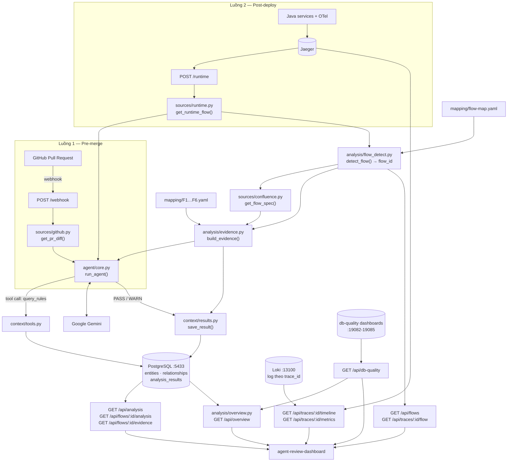

# agent-review — AI Agent đảm bảo chất lượng phần mềm

Backend Flask chạy **AI Agent** đối chiếu code và hành vi runtime với **quy tắc nghiệp vụ / tài liệu thiết kế**,
rồi kết luận `PASS` / `WARN`. Agent hoạt động trên hai luồng, dùng chung một Project Context (PostgreSQL)
và một Agent Core (Google Gemini).

| | Luồng 1 — Pre-merge | Luồng 2 — Post-deploy |
|---|---|---|
| Kích hoạt | GitHub webhook khi có Pull Request | Gọi thủ công / định kỳ sau khi deploy |
| Endpoint | `POST /webhook` | `POST /runtime` |
| Đầu vào | Code diff của PR (GitHub API) | Trace từ Jaeger, hoặc raw log |
| Đối chiếu với | Business rule trong Project Context | Trang flow trên Confluence (F1–F6, tự nhận diện flow từ trace): bước §2.3, rule §3, NFR §4 |
| Đầu ra | JSON trả về cho caller | JSON **và** lưu vào bảng `analysis_results`, kèm bảng bằng chứng từng bước |

Kết quả của Luồng 2 được [agent-review-dashboard](https://github.com/talent-vds-global/agent-review-dashboard)
đọc lên qua `GET /api/overview` (màn tổng quan chia theo service), `GET /api/analysis` và
`GET /api/flows/<flow_id>/analysis`, cộng thêm các endpoint cho báo cáo chi tiết: bảng đối chiếu tài
liệu, số liệu của trace (kèm log) và chất lượng database (§6).

---

## 1. Kiến trúc



**Thứ tự xử lý ở Luồng 2: nhận diện flow → tất định → LLM.** `analysis/flow_detect.py` đọc span cửa
vào để biết trace thuộc luồng nghiệp vụ nào (§9), rồi `analysis/evidence.py` so từng bước trong tài
liệu của **đúng flow đó** với span trong trace bằng luật, ra bảng bằng chứng; agent nhận bảng đó làm
dữ kiện rồi mới viết kết luận. Nhờ vậy phần tổng quan do AI viết và phần bằng chứng trong báo cáo
chi tiết không mâu thuẫn nhau, và mỗi bước **đúng** cũng có bằng chứng chứ không chỉ bước thiếu.

### Cách agent suy luận

`agent/core.py` tự điều khiển vòng lặp tool-call (đã **tắt** `automatic_function_calling` của SDK) để
kiểm soát và log được từng bước:

1. Gửi `system_prompt` + dữ liệu đầu vào cho Gemini, kèm khai báo tool `query_rules`.
2. Nếu model yêu cầu gọi tool → thực thi tool trong `AVAILABLE_TOOLS`, trả kết quả về cho model.
3. Lặp tối đa `max_turns = 8` lượt cho tới khi model đưa ra kết luận văn bản.
4. Lỗi tạm thời từ Gemini (`503` quá tải, `429` rate limit) được retry với exponential backoff 1s → 2s → 4s…
   Các lỗi khác (sai API key, sai tham số) ném ra ngay vì thử lại cũng vô ích.

Verdict được tách từ **dòng đầu tiên** của kết luận: có chữ `WARN` → `WARN`, có `PASS` → `PASS`,
còn lại → `UNKNOWN`. Vì vậy prompt bắt buộc model mở đầu bằng đúng một từ trên dòng đầu.

---

## 2. Cấu trúc thư mục

```text
agent-review/
├── app.py                    # Flask app: 2 webhook + 2 API cho dashboard
├── config.py                 # Đọc .env → hằng số cấu hình
├── requirements.txt
├── Dockerfile
├── docker-compose.yml        # postgres + app
├── .env.example
│
├── agent/
│   ├── core.py               # run_agent(): vòng lặp tool-call + retry
│   └── prompt.py             # PROMPT_PRE_MERGE, PROMPT_POST_DEPLOY, FALLBACK_DESIGNS
│
├── analysis/                 # Đối chiếu tất định (chạy TRƯỚC khi gọi LLM)
│   ├── flow_detect.py        # detect_flow(): trace này thuộc luồng nghiệp vụ nào
│   ├── evidence.py           # build_evidence(): bước tài liệu ↔ span runtime, NFR, rule
│   └── check_mapping.py      # CLI kiểm mapping trên một trace, không cần Flask
│
├── mapping/
│   ├── flow-map.yaml         # Cửa vào của từng flow -> dùng để nhận diện trace
│   └── F1.yaml … F6.yaml     # Mỗi bước §2.3 của tài liệu cần thấy span nào trong trace
│
├── context/                  # Project Context (PostgreSQL)
│   ├── db.py                 # get_db_connection()
│   ├── tools.py              # query_rules() — tool agent gọi được
│   └── results.py            # save_result(), get_latest_flow_result(), list_analysis_results()
│
├── sources/                  # Các nguồn dữ liệu đầu vào
│   ├── github.py             # get_pr_diff() — GitHub API
│   ├── runtime.py            # get_spans(), get_runtime_flow(), get_timeline() — Jaeger API
│   ├── confluence.py         # get_flow_spec() (spec có cấu trúc) + bản text cho prompt
│   ├── dbquality.py          # Số liệu database-quality-library, đọc tại thời điểm gọi
│   └── bitbuckit.py          # (chưa triển khai)
│
├── db/
│   ├── seed.sql              # entities + relationships + dữ liệu mẫu
│   └── analysis_table.sql    # bảng analysis_results
│
└── test_*.py                 # Script thử tay từng phần (không phải pytest)
    └── test_flow_detect.py   # Chạy nhận diện flow trên file trace thật của ewallet-demo
```

---

## 3. Mô hình dữ liệu

### Project Context — `entities` + `relationships` (`db/seed.sql`)

Knowledge graph tối giản: mọi thứ là **entity** (`function` / `flow` / `rule`), nối nhau bằng
**relationship** có hướng.

```text
function ──belongs_to──▶ flow ──must_follow──▶ rule
```

Dữ liệu mẫu đang có:

| Entity | Type | Nội dung |
|---|---|---|
| `transfer` | function | Trừ tiền và điều chuyển số dư tài khoản |
| `publish` | function | Phát tán event thông báo giao dịch lên Message Broker |
| `deque` | function | Tiêu thụ tác vụ từ hàng đợi ngầm |
| `chuyen-tien` | flow | Luồng nghiệp vụ chuyển tiền trực tuyến |
| `R-023` | rule | Chuyển tiền > 50 triệu phải xác thực KYC bậc 2 |
| `R-045` | rule | Sau khi trừ tiền phải publish sự kiện để đối soát |

Tool `query_rules(function_name)` đi đúng hai cạnh này để trả về danh sách rule mà hàm phải tuân thủ.
Muốn agent biết thêm rule mới, thêm entity + relationship vào `db/seed.sql` rồi nạp lại.

### Kết quả phân tích — `analysis_results` (`db/analysis_table.sql`)

| Cột | Kiểu | Ý nghĩa |
|---|---|---|
| `id` | SERIAL PK | |
| `flow_id` | TEXT | Mã flow, vd `F1` |
| `analysis_type` | TEXT | `pre_merge` \| `post_deploy` |
| `verdict` | TEXT | `PASS` \| `WARN` \| `UNKNOWN` |
| `detail` | TEXT | Toàn văn kết luận của agent (Markdown) |
| `runtime_flow` | TEXT | Chuỗi các bước runtime đã lọc nhiễu |
| `trace_id` | TEXT | Trace đã dùng để phân tích — dashboard mở lại sơ đồ trace từ đây |
| `evidence` | JSONB | Bảng đối chiếu tài liệu ↔ runtime, đóng băng cùng verdict |
| `created_at` | TIMESTAMP | Mặc định `NOW()` |

`db/analysis_table.sql` chạy lại được nhiều lần: có `CREATE TABLE IF NOT EXISTS` và
`ALTER TABLE ... ADD COLUMN IF NOT EXISTS` cho hai cột mới, nên bảng cũ nâng cấp tại chỗ.

> Hiện **chỉ Luồng 2 (`/runtime`) ghi vào bảng này**. Luồng 1 mới trả JSON, chưa lưu DB.

---

## 4. Cài đặt

### Yêu cầu

- Python 3.11+
- Docker (cho PostgreSQL)
- Gemini API key — lấy ở [Google AI Studio](https://aistudio.google.com/apikey)
- GitHub Personal Access Token (chỉ cần cho Luồng 1; scope `repo` nếu repo private)
- Jaeger đang chạy (chỉ cần cho Luồng 2) — xem `ewallet-demo/docker-compose.yml`

### 4.1 Môi trường Python

```bash
python -m venv venv
```

Kích hoạt trên Windows:

```bash
.\venv\Scripts\activate
```

Kích hoạt trên Linux / macOS:

```bash
source venv/bin/activate
```

Cài thư viện:

```bash
pip install -r requirements.txt
```

### 4.2 Biến môi trường

```bash
cp .env.example .env
```

Điền vào `.env`:

```env
GEMINI_API_KEY=AIzaSy...
GITHUB_TOKEN=ghp_...

DB_HOST=localhost
DB_PORT=5433
DB_NAME=context
DB_USER=postgres
DB_PASSWORD=devpass

MODEL=gemini-2.5-flash
JAEGER_URL=http://localhost:16686

CONFLUENCE_BASE_URL=https://<your-site>.atlassian.net
CONFLUENCE_EMAIL=you@example.com
CONFLUENCE_TOKEN=
```

Toàn bộ biến và giá trị mặc định nằm ở [`config.py`](config.py). Lưu ý `JAEGER_URL` chưa có sẵn trong
`.env.example` — thêm tay nếu Jaeger không chạy ở `localhost:16686`.

### 4.3 PostgreSQL + nạp schema

```bash
docker run --name pg-context -e POSTGRES_DB=context -e POSTGRES_USER=postgres -e POSTGRES_PASSWORD=devpass -p 5433:5432 -d postgres:16-alpine
```

Nạp **cả hai** file SQL:

```bash
docker exec -i pg-context psql -U postgres -d context < db/seed.sql
```

```bash
docker exec -i pg-context psql -U postgres -d context < db/analysis_table.sql
```

Kiểm tra:

```bash
docker exec -it pg-context psql -U postgres -d context -c "\dt"
```

Phải thấy đủ 3 bảng: `entities`, `relationships`, `analysis_results`.

### 4.4 Chạy server

```bash
python app.py
```

Server lắng nghe tại `http://0.0.0.0:8000`. Kiểm tra sống:

```bash
curl http://localhost:8000/
```

---

## 5. Chạy bằng Docker Compose

```bash
docker compose up --build
```

Compose dựng `db` (PostgreSQL, host port 5433) + `app` (Flask 8000), tự override `DB_HOST=db` và
`DB_PORT=5432` để app gọi DB qua mạng nội bộ của compose.

Hai lưu ý:

- Compose chỉ mount `db/seed.sql` vào `docker-entrypoint-initdb.d`, **không** mount `analysis_table.sql`.
  Sau khi container `db` khởi động lần đầu, nạp thêm bảng kết quả:

  ```bash
  docker compose exec -T db psql -U postgres -d context < db/analysis_table.sql
  ```

- `seed.sql` chỉ chạy **lần đầu** khi volume `pgdata` còn trống. Muốn nạp lại từ đầu, chạy
  `docker compose down -v` rồi `up` lại.

---

## 6. API

### `GET /` — health check

```json
{
  "service": "Software Quality AI Agent",
  "status": "running",
  "endpoints": { "...": "..." }
}
```

### `POST /webhook` — Luồng 1: Pre-merge

Nhận payload GitHub webhook sự kiện Pull Request. Chỉ xử lý `action` thuộc
`opened` / `synchronize` / `reopened`; action khác trả `200` kèm thông báo bỏ qua.

Request (rút gọn từ payload GitHub):

```json
{
  "action": "opened",
  "pull_request": { "number": 1, "title": "Cập nhật hàm transfer" },
  "repository": { "full_name": "owner/repo" }
}
```

Response:

```json
{
  "status": "success",
  "stage": "pre_merge",
  "repo": "owner/repo",
  "pr_number": 1,
  "verdict": "WARN",
  "conclusion": "WARN\n..."
}
```

Agent được yêu cầu **bỏ qua** lỗi cú pháp / style / lint (để CI và linter lo) và chỉ soi tính đúng đắn
về nghiệp vụ.

### `POST /runtime` — Luồng 2: Post-deploy

Body — tất cả trường đều tuỳ chọn:

| Trường | Mặc định | Ý nghĩa |
|---|---|---|
| `flow_id` | **tự nhận diện từ trace** | Ép dùng tài liệu của một flow cụ thể. Bỏ trống → §9 |
| `trace_id` | — | Trace cụ thể trong Jaeger. Bỏ trống → tự tìm |
| `service` | `"ewallet-payment-order"` | Tên service trong Jaeger để tìm trace mới nhất |
| `operation` | — | Lọc thêm theo operation khi tìm trace |
| `log` | — | Raw log dạng text/JSON, chỉ dùng khi **không** tìm được trace |

Thứ tự chọn trace:

```text
trace_id trong body
  └─ không có, mà có flow_id → latest_trace_for_flow(flow_id)  [trace mới nhất CỦA FLOW ĐÓ]
       └─ không có → get_latest_trace_id(service, operation)   [Jaeger]
            └─ không có → payload.log hoặc raw body            [parse_log]
                 └─ vẫn trống → HTTP 400
```

Có trace rồi thì **nhận diện flow trước, đọc tài liệu sau**: đối chiếu trace với tài liệu của flow
khác thì bước nào cũng "thiếu" và verdict vô nghĩa. Không nhận ra flow (cửa vào chưa khai báo) →
`HTTP 422` kèm `detection` giải thích lý do, thay vì âm thầm dùng F1. Truyền `flow_id` mà khác với
kết quả nhận diện thì hệ thống vẫn làm theo yêu cầu nhưng ghi log cảnh báo — cần thiết cho F4/F5,
hai flow chạy bên trong trace của flow khác (§9).

Khi tìm trace mới nhất theo service, `get_latest_trace_id()` lấy 50 trace gần nhất rồi bỏ qua trace
hạ tầng (root operation chứa `actuator` / `health`) và trace quá ngắn (< 5 span), để không phân tích
nhầm health check.

Response:

```json
{
  "status": "success",
  "stage": "post_deploy",
  "id": 12,
  "flow_id": "F1",
  "trace_id": "692dd4b78be88c1575722dce4145985e",
  "detection": {
    "kind": "flow", "flow_id": "F1", "slug": "topup-partner",
    "entry": { "service": "ewallet-business-customer-mobileapp",
               "method": "POST", "route": "/api/wallet/topup", "status_code": 200 },
    "overlays": [{ "flow_id": "F5", "variant": "consume", "reason": "..." }],
    "reason": "Cửa vào ... khớp flow F1."
  },
  "verdict": "WARN",
  "conclusion": "WARN\n...",
  "runtime_flow": "1. [ewallet-gateway] POST /api/wallet/topup (1840.2ms)\n2. ..."
}
```

Trường `evidence` trong response là **bảng đối chiếu tất định** — xem §7; `detection` là kết quả
nhận diện flow — xem §9.

### `GET /api/analysis` — danh sách kết quả

Trả mảng `{ id, flow_id, analysis_type, verdict, trace_id, created_at }`, mới nhất trước.
Nhận `?limit=` (mặc định 50).

### `GET /api/flows` — danh sách luồng nghiệp vụ đã khai báo

Trả mảng `{ flow_id, slug, title, entries[], has_mapping, page_id }` đọc từ `mapping/flow-map.yaml`.
Dashboard đổ được danh sách flow ngay cả khi chưa flow nào có kết quả phân tích; `has_mapping` cho
biết flow đã có file ánh xạ riêng hay còn dùng matcher suy tự động.

### `GET /api/traces/<trace_id>/flow` — trace này thuộc flow nào

Trả kết quả nhận diện (`kind`, `flow_id`, `entry`, `overlays`, `reason`) — xem §9. Dùng để kiểm
nhanh cấu hình nhận diện mà không phải chạy cả vòng phân tích.

### `GET /api/flows/<flow_id>/analysis` — chi tiết kết quả mới nhất của một flow

Trả bản ghi đầy đủ kèm `detail`, `runtime_flow`, `trace_id` và `evidence`.
Không có dữ liệu → `404` kèm `{ "error": "..." }`.

`evidence` ở đây là bản **đã đóng băng cùng verdict** — đọc lại bao nhiêu lần cũng giống nhau, kể cả
khi tài liệu Confluence đã đổi sau đó.

### `GET /api/flows/<flow_id>/evidence` — dựng lại bảng đối chiếu ngay lúc gọi

| Tham số | Mặc định | Ý nghĩa |
|---|---|---|
| `trace_id` | trace của bản ghi mới nhất, rồi tới trace mới nhất **của chính flow đó** | Trace cần đối chiếu |
| `service` | — | Chỉ dùng khi hai cách trên không ra trace nào |

Đọc lại trang Confluence + trace rồi tính lại từ đầu, **không gọi LLM**. Dùng khi vừa sửa tài liệu
và muốn biết trace cũ có còn khớp không.

### `GET /api/traces/<trace_id>/timeline` — sơ đồ trace đã rút gọn

Trả `{ trace_id, total_duration_ms, span_count, step_count, services[], steps[], db_rollup[] }`.
Tham số `db=0` để bỏ chi tiết truy vấn của từng bước. Quy tắc rút gọn ở §8.

### `GET /api/traces/<trace_id>/metrics` — số liệu của một trace (không kèm danh sách bước)

Trả `{ total_duration_ms, span_count, step_count, error_count, services[], db{}, slowest_steps[],
error_steps[], logs{} }`. Khác `/timeline` ở chỗ **không** trả `steps[]`: dashboard không vẽ lại
trace nữa, chỉ hiện số liệu trả lời "chạy hết bao lâu, thu được bao nhiêu span và log, có lời gọi
nào lỗi".

`logs` lấy từ Loki bằng chính `trace_id` (OTel Java Agent gắn context vào MDC nên mỗi dòng log mang
sẵn `trace_id`): `{ available, total, by_level, error_count, warn_count, errors[], explore_url }`.
Cửa sổ truy vấn lấy từ mốc thời gian thật của trace. Loki không chạy thì `available=false` kèm lý
do — các số liệu còn lại vẫn trả đủ. Tham số `logs=0` để bỏ qua bước này. Cấu hình `LOKI_URL`,
`GRAFANA_URL` (dựng link "mở log trong Grafana").

### `GET /api/overview` — tổng quan chất lượng toàn hệ thống, chia theo service

Gộp bảng đối chiếu **mới nhất của từng flow** (`analysis/overview.py`) thành một bức tranh mức hệ
thống cho màn dashboard đầu tiên:

| Trường | Nội dung |
|---|---|
| `health` | trạng thái chung (`healthy` / `warning` / `critical` / `unknown`) + số tiêu chí đạt |
| `metrics[]` | từng tiêu chí chất lượng: `passed` = true/false/**null** (chưa đủ dữ liệu để kết luận) |
| `issues[]` | lỗi đang bắt được, mỗi dòng trỏ về flow + tab chứa bằng chứng |
| `services[]` | từng service: luồng đi qua, verdict, vấn đề quy về chính nó, số liệu DB |
| `flows[]` | từng flow: verdict, trace, tóm tắt đối chiếu, service tham gia |

Không phân tích lại — mọi con số đọc từ `analysis_results.evidence` đã lưu cùng verdict, nên khớp
với báo cáo chi tiết. Service tham gia một flow lấy từ `mapping/<flow>.yaml` + `flow-map.yaml` nên
flow **chưa từng phân tích** vẫn hiện đủ service của nó.

Tham số `db=1` để gọi thêm dashboard db-quality (thêm tiêu chí "Chạy tốt về database?"); mặc định
tắt vì service không chạy thì phải chờ hết timeout.

### `GET /api/db-quality` — số liệu database tại thời điểm gọi

Tham số `services` là danh sách tên service ngăn cách bằng dấu phẩy; bỏ trống thì trả tất cả service
có cấu hình. Mỗi service trả `{ score, metrics, findings[], slow_queries[], top_queries[] }` lấy từ
dashboard của `database-quality-library` (Topic #80).

**Không có bản ghi lịch sử** — thư viện thống kê theo cửa sổ thu thập, nên con số phản ánh đúng thời
điểm người dùng mở tab. Cấu hình cổng bằng `DB_QUALITY_URLS` (xem `.env.example`).

CORS đã bật toàn cục (`flask_cors.CORS(app)`) để dashboard chạy ở cổng khác gọi được.

---

## 7. Đối chiếu tài liệu ↔ runtime (evidence mapping)

Câu hỏi mà phần này trả lời: *"lấy gì chứng minh bước này đã chạy đúng?"* — cho **mọi** bước, không
riêng bước thiếu.

### 7.1 Ba mảnh ghép

| Mảnh | Nguồn | Nội dung |
|---|---|---|
| Tài liệu | `sources/confluence.py` → `get_flow_spec()` | Bảng §2.3 (bước), §3 (rule), §4 (NFR) của trang flow |
| Runtime | `sources/runtime.py` → `get_spans()` | Span đã chuẩn hoá: service, giao thức, thời lượng, thuộc tính |
| Ánh xạ | `mapping/<flow>.yaml` | Mỗi bước trong tài liệu cần thấy **dấu vết nào** trong trace |

`analysis/evidence.py` ghép ba mảnh đó thành bảng kết quả. Tài liệu vẫn là nguồn sự thật — file ánh
xạ không mô tả lại nghiệp vụ, nó chỉ nói cách nhận ra một bước trong trace.

### 7.2 Trạng thái từng bước

| Trạng thái | Nghĩa |
|---|---|
| `MATCHED` | Thấy đủ dấu vết yêu cầu |
| `PARTIAL` | Thấy một phần (matcher bắt buộc chỉ khớp vài cái), **hoặc** có dấu vết nhưng vượt trần `max_count` — chạy rồi nhưng không đúng cách tài liệu yêu cầu |
| `MISSING` | Không thấy dấu vết nào — căn cứ để kết luận bước không chạy |
| `NOT_OBSERVABLE` | Tài liệu có bước nhưng bước đó không để lại span (vd validate cú pháp trong bộ nhớ). Ghi kèm bằng chứng gián tiếp và lý do |
| `NOT_IN_BRANCH` | Trace này không đi qua bước đó — **không phải lỗi**. Hai lý do: nhánh nghiệp vụ dừng sớm (§7.3) hoặc bước thuộc đoạn khác của flow (§7.4) |

### 7.3 Nhánh nghiệp vụ

Một trace `202 HELD` không "thiếu 15 bước" — nó đi nhánh khác. Khối `outcome` trong file ánh xạ lấy
mã HTTP ở cửa vào saga (`POST /api/orders`) để chọn nhánh theo §2.4 của tài liệu, rồi:

- đánh dấu các bước sau `stop_after_step` là `NOT_IN_BRANCH`;
- thêm các yêu cầu **riêng của nhánh** qua `expect_extra` (vd nhánh HELD bắt buộc publish
  `PaymentHeld` theo §2.4 A7).

`outcome.from` nhận một matcher hoặc **danh sách** matcher (thử lần lượt, lấy cái đầu tiên có span).
Cần cho flow có nhiều cửa vào: F4 đọc mã của `POST /api/orders` ở nhánh bù trừ tự động nhưng đọc mã
của `POST /api/orders/{orderId}/refund` ở nhánh Ops hoàn tiền.

`stop_after_step` phải đặt đúng chỗ: nhánh từ chối (`422`) của F2/F3 dừng **trước** bước ghi sổ giữ
tiền, vì bước đó mô tả việc giữ tiền mà nhánh từ chối không làm. Đặt nhầm một bước là mọi giao dịch
bị từ chối đúng luật đều thành `PARTIAL` → `WARN` giả.

### 7.4 Đoạn của flow (`segments`)

Một flow có thể trải trên **nhiều lần gọi HTTP độc lập**, mỗi lần một trace riêng. F2 gồm "tra cứu
hoá đơn" (bước 1–6) rồi "thanh toán" (bước 7–14); biến thể TELCO bỏ hẳn bước 1–6 theo §2.3. Không
khai báo đoạn thì mọi trace thanh toán đều bị báo thiếu 6 bước vốn nằm ở trace khác.

```yaml
segments:
  - id: pay
    label: Thanh toán hoá đơn
    when:
      - {service: ewallet-business-customer-mobileapp, kind: server, http: {route: /api/wallet/bill/pay}}
    steps: ["7", "8", "9", "10", "11", "12", "13", "14"]
    note: Bước tra cứu (1–6) là một lần gọi HTTP riêng nên nằm ở trace khác.
```

Đoạn đầu tiên có matcher khớp sẽ thắng, nên thứ tự trong file có ý nghĩa: đặt đoạn hẹp trước đoạn
rộng. Bước ngoài đoạn được đánh `NOT_IN_BRANCH` kèm ghi chú. Không đoạn nào khớp → đối chiếu toàn bộ
các bước như cũ.

### 7.5 Cú pháp file ánh xạ

```yaml
steps:
  "18":
    evidence:
      - service: ewallet-payment-business
        kafka: {topic: ewallet.payment.events, operation: publish}
        label: Kafka publish ewallet.payment.events (R-EVENT-01)
    note: Tên event không nằm trong thuộc tính span, chỉ thấy topic.

  "3":
    observable: false
    reason: Validate cú pháp chạy trong bộ nhớ, không sinh span.
    anchor: {service: ewallet-business-customer-mobileapp, kind: server, http: {path: /api/wallet/topup}}
```

Matcher nhận: `service`, `kind` (`server|client|producer|consumer`), `type` (`http|grpc|kafka|ws|db`),
`http {method, route, path, peer, status}`, `grpc {method}`, `kafka {topic, operation}`,
`ws {frame, operation}`, `db {op, table, sql_contains}`, `min_count`, `max_count`, `optional`.
Bước có `require: any` thì chỉ cần một matcher khớp.

- `route` khớp **chính xác** với `http.route` (template, vd `/api/orders/{orderId}/refund`);
  `path` khớp kiểu **"chứa"** trên `http.route` hoặc `url.path`. Dùng `route` khi phải phân biệt
  các endpoint lồng nhau — `/api/orders` là tiền tố của `/api/orders/history`.
- `max_count` là **trần**: tài liệu đòi bước chỉ được sinh tối đa ngần ấy lời gọi. Vượt trần thì
  bước là `PARTIAL` (dấu vết vẫn có, chỉ là sai cách) chứ không phải `MISSING`.
- `min_count: 0` + `max_count: 0` = **"phải KHÔNG có dấu vết nào"** — cách duy nhất kiểm được các
  mệnh đề phủ định của tài liệu. Ví dụ đang dùng: F3 bước 7 ("bỏ qua S3 vì `partnerCode` rỗng"),
  F2 bước 6 ("không ghi DB nghiệp vụ"), F4 bước 6 (R-COMP-01 — business không được tự bù trừ).

**Flow chưa có file ánh xạ** vẫn chạy được: hệ thống tự suy matcher từ chính câu mô tả trong tài liệu
(đường dẫn HTTP, tên RPC sau chữ "gRPC", tên topic, tên bảng). Những dấu vết suy tự động được đánh
dấu *suy tự động* trên giao diện vì độ tin cậy thấp hơn.

### 7.6 NFR

Khối `nfr` khai báo điểm đo của từng mã NFR trong §4 tài liệu — ví dụ `NFR-LAT-01` đo ở span gRPC
`AuthorizePayment` phía `ewallet-payment-business`. Giá trị đo là **số thật trên trace đang xem**
(một trace nên là giá trị của chính span đó, không phải p95 của cả hệ).

Bốn cách đo:

| Khai báo | Đo gì | Dùng ở |
|---|---|---|
| `measure: {matcher}` | Thời lượng span lâu nhất khớp matcher | `NFR-LAT-*`, `NFR-TIMEOUT-01`, `NFR-DB-02` |
| `metric: error_rate_in_trace` | Số span giao thức lỗi / tổng span giao thức | `NFR-ERR-01` |
| `metric: db_query_count` + `of: {matcher}` | Đếm câu SQL trong phạm vi — biến "N+1" thành số | `NFR-DB-01` (F6) |
| `metric: elapsed_between` + `from`/`to` (+ `from_edge`/`to_edge`) | Khoảng cách giữa hai span | `NFR-LAT-05` (F5), `NFR-COMP-01` (F4) |

`error_rate_in_trace` nhận thêm `ignore_status`: các mã HTTP là **kết cục nghiệp vụ** đã khai trong
§2.4 chứ không phải lỗi hệ thống (`422 INSUFFICIENT_FUNDS`…). Không khai thì mọi giao dịch bị từ chối
đúng luật đều đẩy error_rate lên ~50% và sinh cảnh báo giả; mã 5xx vẫn được tính đủ.

NFR chỉ có ý nghĩa khi cộng dồn nhiều trace (consumer lag, tỉ lệ vào DLT, p95 toàn hệ) thì **không
khai `measure`/`metric`**, chỉ khai `point` giải thích — bảng sẽ hiện `NO_DATA` kèm lý do thay vì
một con số sai.

### 7.7 Verdict

`summary.verdict` của bảng là kết quả tất định: có bước `MISSING`/`PARTIAL` mức `must`, hoặc có NFR
`FAIL` → `WARN`. Agent nhận bảng này trong prompt và **không được hạ** `WARN` xuống `PASS` —
`app.py` áp lại luật đó sau khi agent trả lời.

### 7.8 Kiểm nhanh khi sửa mapping

Trace mới nhất, tự nhận diện flow:

```bash
python -m analysis.check_mapping
```

Trace mới nhất **của một flow cụ thể**:

```bash
python -m analysis.check_mapping F3
```

Một trace đích danh (flow vẫn tự nhận diện):

```bash
python -m analysis.check_mapping 3c0ec1efc125bc39105b9d13497b8905
```

Ép mapping của flow khác — cần cho F4/F5, hai flow chạy bên trong trace của flow khác (§9.3):

```bash
python -m analysis.check_mapping F5 3c0ec1efc125bc39105b9d13497b8905
```

In ra kết quả nhận diện flow, từng bước, dấu vết cần có, bằng chứng thu được và bảng NFR — không cần
Flask hay dashboard. Thêm `--json` để xem nguyên payload mà dashboard nhận.

---

## 8. Lọc nhiễu trace

Trace Java qua OpenTelemetry sinh rất nhiều span kỹ thuật (Hibernate, JDBC) làm loãng ngữ cảnh gửi
cho LLM. `sources/runtime.py` loại bỏ chúng trước khi đưa vào prompt:

| Loại | Giá trị |
|---|---|
| Bỏ theo tiền tố | `Session.`, `Transaction.commit`, `SELECT com.`, `SELECT `, `INSERT `, `UPDATE ` |
| Bỏ chính xác | `orderdb`, `paymentdb`, `notifdb`, `thirdpartydb` |

Span còn lại được sắp theo `startTime`, đánh số, kèm thời lượng, và gắn `[LỖI]` nếu span có tag
`error=true`:

```text
1. [ewallet-gateway] POST /api/wallet/topup (1840.2ms)
2. [ewallet-payment-order] CREATE_ORDER (120.5ms)
3. [ewallet-third-party] ExecutePartnerPayment (3120.8ms) [LỖI]
```

Dashboard đọc đúng chuỗi này và tô đỏ các dòng chứa `[LỖI]`.

### 8.1 Sơ đồ trace rút gọn cho dashboard

Màn hình Jaeger vẽ đủ 100% span nên một giao dịch F1 hiện ra **160 dòng** — quá chi tiết để soi
nghiệp vụ. `build_timeline()` rút còn khoảng 15 dòng bằng ba luật:

1. Bỏ toàn bộ span ORM/nội bộ (`Session.*`, `Transaction.commit`, `SELECT <entity>`).
2. Gộp cặp CLIENT + SERVER của cùng một lời gọi thành **một** dòng, giữ cả thời gian phía gọi
   (có network) lẫn thời gian phía phục vụ (`server_ms`).
3. Truy vấn JDBC không thành dòng riêng mà **cuộn lên** bước cha gần nhất, gom theo (thao tác, bảng)
   — chỉ hiện số lượt và tổng thời gian.

Kết quả còn giữ `span_count` gốc để người xem biết đã rút gọn bao nhiêu, và `db_rollup` toàn trace để
thấy ngay bảng nào bị gọi lặp (dấu hiệu N+1).

Hai chi tiết đã đo trên trace thật của `ewallet-demo`:

- Gateway đặt `http.route` = **ID của route** ("wallet") chứ không phải đường dẫn → nhãn lấy
  `url.path` cho dễ đọc.
- Span ORM của Hibernate có `otel.status_code=ERROR` khi không tìm thấy entity — đó là luồng bình
  thường của code, nên chỉ span giao thức mới được tính là lỗi.

---

## 9. Nhận diện luồng nghiệp vụ của một trace

Câu hỏi mà phần này trả lời: *"trace vừa lấy về thuộc luồng nào?"* — phải có câu trả lời **trước**
khi đọc tài liệu, vì đối chiếu một trace F3 với tài liệu F1 thì bước nào cũng "thiếu".

Trước đây `flow_id` do người gọi truyền tay (`POST /runtime` mặc định `"F1"`). Giờ
`analysis/flow_detect.py` tự xác định, cấu hình ở `mapping/flow-map.yaml`.

### 9.1 Cách xác định

**Span cửa vào** = span `kind=server` bắt đầu sớm nhất, **bỏ qua** `ewallet-gateway`. Bỏ qua gateway
là bắt buộc: đo trên trace thật thấy `http.route` của gateway là ID cấu hình (`wallet`,
`orders-internal`), không phân biệt được `/api/wallet/topup` với `/api/wallet/transfer`. Trace không
có span server nào ngoài gateway nhưng có span consumer thì cửa vào là span consumer.

Cửa vào đó được so với `flows[].entries` bằng **đúng bộ matcher của `mapping/<flow>.yaml`** — toàn hệ
chỉ có một cú pháp so khớp span. Ở đây dùng `http.route` khớp **chính xác** (khoá `route`) chứ không
phải `path` khớp kiểu "chứa", vì `/api/orders` là tiền tố của `/api/orders/history`.

### 9.2 Bốn kết quả

| `kind` | Nghĩa |
|---|---|
| `flow` | Nhận ra flow — `flow_id` dùng được ngay |
| `ignored` | Cửa vào nằm trong `ignore.routes`: `/actuator/*`, `*/ping`, `/admin/*`, swagger… — bỏ qua có chủ đích |
| `background` | Không có span server/consumer nào (chỉ JDBC nền: db-quality quét định kỳ, poller outbox) |
| `unmapped` | Có cửa vào thật nhưng chưa khai báo — cần bổ sung `entries` hoặc `ignore.routes` |

`unmapped` là tín hiệu hữu ích chứ không phải lỗi vặt: nó nghĩa là hệ thống vừa mọc thêm một endpoint
mà tài liệu flow chưa nhắc tới.

### 9.3 Nhãn phụ (overlay)

Có việc xảy ra **bên trong** trace của flow khác, không đổi flow chính:

| Nhãn | Khi nào | Vì sao cần |
|---|---|---|
| `F4:F4a/F4c` | Trace có gRPC `ReversePayment` | Giao dịch đã giữ tiền rồi phải bù trừ. Baseline của F1/F2/F3 **phải loại** trace này ra, vì bù trừ đẩy error_rate của flow gốc lên |
| `F4:F4b` | `POST /api/orders` trả `422` | Business từ chối ngay ở S2, chưa giữ tiền nên không có bước bù trừ |
| `F5:consume` | Trace có consumer trên `ewallet.payment.events` | Đuôi thông báo chạy trong chính trace giao dịch (context đi theo header Kafka) |
| `F5:dead-letter` | Có span trên `…events.DLT` | Event đã hết lượt thử lại |

Vì vậy F4 và F5 hiếm khi là flow chính. Muốn soi riêng hai flow đó thì **ép mapping** trên chính
trace của giao dịch:

```bash
python -m analysis.check_mapping F5 460139087b736e34547d76a8226bd4ae
```

### 9.4 Kiểm cấu hình trên trace thật

```bash
python test_flow_detect.py
```

Đọc `traces*.jsonl` mà otel-collector của `ewallet-demo` ghi ra, phân loại từng trace và in ra số
trace mỗi flow, các nhãn phụ, và **cửa vào chưa được map**. Trả mã 1 nếu còn cửa vào chưa map nên
dùng được trong CI. Không cần Jaeger, không cần Confluence.

Kết quả trên bộ trace hiện có của `ewallet-demo` (19.395 trace):

```text
  F1 topup-partner                  21
  F2 bill-telco-payment             22
  F3 p2p-transfer                  121
  F4 failure-refund                  1
  F5 async-notification              4
  F6 transaction-history             6
     background                  19084
     ignored                       136
     unmapped                        0
```

98% là trace nền chỉ có span JDBC — đó là lý do `get_latest_trace_id()` phải lọc trước khi chọn, và
là lý do `latest_trace_for_flow()` tồn tại: lọc theo service thôi thì gần như luôn trả nhầm flow.

### 9.5 Thêm một flow mới

1. Thêm mục vào `flows:` trong `mapping/flow-map.yaml` với `entries` là cửa vào của flow.
2. Chạy `python test_flow_detect.py` cho tới khi phần "cửa vào chưa được map" trống.
3. Thêm page id của trang Confluence vào `FLOW_PAGE_MAP` (`sources/confluence.py`) hoặc biến môi
   trường `CONFLUENCE_FLOW_PAGES`.
4. Viết `mapping/<flow>.yaml` (§7). Chưa có file này thì hệ thống vẫn chạy bằng matcher suy tự động.

---

## 10. Nối GitHub webhook

Mở tunnel ra ngoài bằng ngrok:

```bash
ngrok http 8000
```

Hoặc Cloudflare Tunnel:

```bash
cloudflared tunnel --url http://localhost:8000
```

Trong repo GitHub: **Settings → Webhooks → Add webhook**

- Payload URL: `https://<tunnel-domain>/webhook`
- Content type: `application/json`
- Events: *Let me select individual events* → tích **Pull requests**

---

## 11. Kiểm thử nhanh

### Luồng 1 — giả lập webhook

```bash
curl -X POST http://localhost:8000/webhook -H "Content-Type: application/json" -d "{\"action\":\"opened\",\"pull_request\":{\"number\":1,\"title\":\"Cap nhat ham transfer\"},\"repository\":{\"full_name\":\"octocat/Hello-World\"}}"
```

### Luồng 2 — lấy trace mới nhất, để hệ thống tự nhận diện flow

```bash
curl -X POST http://localhost:8000/runtime -H "Content-Type: application/json" -d "{}"
```

### Luồng 2 — trace mới nhất của một flow cụ thể

```bash
curl -X POST http://localhost:8000/runtime -H "Content-Type: application/json" -d "{\"flow_id\":\"F3\"}"
```

### Luồng 2 — từ raw log, không cần Jaeger

```bash
curl -X POST http://localhost:8000/runtime -H "Content-Type: application/json" -d "{\"flow_id\":\"F1\",\"log\":\"INFO [transfer] Bat dau chuyen 100000000 VND\nINFO [transfer] Da tru tien tai khoan nguon\nINFO [transfer] Ket thuc, khong phat sinh event\"}"
```

Agent sẽ gọi `query_rules(function_name='transfer')`, thấy `R-023` và `R-045`, rồi kết luận `WARN`
vì thiếu xác thực KYC bậc 2 và thiếu bước publish event đối soát.

### Luồng 2 — chỉ đích danh một trace

```bash
curl -X POST http://localhost:8000/runtime -H "Content-Type: application/json" -d "{\"trace_id\":\"3c0ec1efc125bc39105b9d13497b8905\"}"
```

Hữu ích khi muốn so hai nhánh: một trace `200 COMPLETED` và một trace `202 HELD` của cùng flow F1.

### Xem trace thuộc flow nào

```bash
curl "http://localhost:8000/api/traces/3c0ec1efc125bc39105b9d13497b8905/flow"
```

```bash
curl http://localhost:8000/api/flows
```

### Đối chiếu tài liệu mà không gọi LLM

```bash
python -m analysis.check_mapping F1
```

```bash
curl "http://localhost:8000/api/flows/F3/evidence"
```

### Sơ đồ trace rút gọn & số liệu DB

```bash
curl "http://localhost:8000/api/traces/3c0ec1efc125bc39105b9d13497b8905/timeline"
```

```bash
curl "http://localhost:8000/api/db-quality?services=ewallet-payment-order"
```

### Đọc lại kết quả đã lưu

```bash
curl http://localhost:8000/api/analysis
```

```bash
curl http://localhost:8000/api/flows/F1/analysis
```

### Script thử tay

Các file `test_*.py` ở thư mục gốc là **script chạy tay**, không phải test suite pytest:

| File | Dùng để |
|---|---|
| `test_trace.py` | In trace Jaeger sau khi lọc nhiễu, kiểm tra bộ lọc có đúng không |
| `test_runtime_check.py` | Chạy trọn Luồng 2 không qua Flask (trace → agent → lưu DB) |
| `test_confluence.py` | Lấy một trang Confluence, lưu ra `f1_content.html` |
| `test_flow_detect.py` | Chạy nhận diện flow trên file trace thật của `ewallet-demo` — **không cần Jaeger** (§9.4) |

`test_trace.py` và `test_runtime_check.py` đang **hardcode `TRACE_ID`** — sửa lại theo trace thật của
bạn trước khi chạy. `test_flow_detect.py` thì tự tìm `traces*.jsonl` trong repo `ewallet-demo` nằm
cạnh repo này; chỉ đường dẫn khác bằng `--traces`.

---

## 12. Hiện trạng & giới hạn

| Hạng mục | Trạng thái |
|---|---|
| Luồng 2 lưu kết quả vào DB | ✅ |
| Luồng 1 lưu kết quả vào DB | ❌ chỉ trả JSON |
| Luồng 1 comment ngược lên PR | ❌ chưa có |
| Tài liệu thiết kế flow | ✅ đọc từ Confluence cho cả F1–F6; `DESIGN_F1` chỉ còn là bản dự phòng khi mất mạng |
| Confluence | ✅ đã nối: `get_flow_spec()` trả spec có cấu trúc cho cả agent lẫn bảng đối chiếu |
| Đối chiếu tài liệu ↔ runtime | ✅ tất định, có bằng chứng cho cả bước đúng lẫn bước thiếu |
| Nhận diện flow của một trace | ✅ `mapping/flow-map.yaml` + `analysis/flow_detect.py`; kiểm trên 19.395 trace thật, 0 cửa vào chưa map |
| File ánh xạ theo flow | ✅ đủ `mapping/F1.yaml` … `F6.yaml` |
| Hiệu chỉnh mapping trên trace thật | ⚠️ F1–F6 đã chạy trên trace mẫu của mọi nhánh **có trong bộ trace hiện có**; các nhánh chưa từng xảy ra (F2 `202 HELD`, F3 `502`, F4 `409`) chưa được kiểm |
| `NFR-ERR-01` của F1 | ⚠️ chưa khai `ignore_status` nên trace `422` (từ chối đúng luật) vẫn bị tính error_rate 50% → `WARN` giả; F2–F6 đã khai. Sửa: thêm `ignore_status: [400, 404, 409, 422]` vào `mapping/F1.yaml` |
| Số liệu DB | ⚠️ đọc tại thời điểm xem, **không** lưu lịch sử để so sánh theo thời gian |
| Tool của agent | ⚠️ mới có `query_rules`; `query_impact` và `query_baseline` còn là stub |
| Bitbucket | ❌ `sources/bitbuckit.py` rỗng |
| Xác thực webhook | ❌ chưa kiểm tra `X-Hub-Signature-256` |
| `debug=True` | ⚠️ đang bật trong `app.py`, tắt trước khi lên môi trường thật |

Một khác biệt cấu hình cần biết: `config.py` mặc định `MODEL=gemini-3.6-flash`, còn `.env.example`
ghi `gemini-2.5-flash`. Giá trị trong `.env` thắng — nên đặt rõ để tránh nhầm.

---

## 13. Xử lý sự cố

| Triệu chứng | Nguyên nhân thường gặp |
|---|---|
| `ModuleNotFoundError: No module named 'flask_cors'` | Chạy lại `pip install -r requirements.txt` |
| `relation "analysis_results" does not exist` | Chưa nạp `db/analysis_table.sql` (xem §4.3) |
| `/api/flows/F1/analysis` trả 404 | Chưa chạy `POST /runtime` lần nào cho flow đó |
| `Không tìm thấy trace_id và không có dữ liệu log` | Jaeger chưa có trace của service đó, hoặc sai `JAEGER_URL` |
| `Lỗi khi kết nối tới Jaeger` | Jaeger chưa chạy; khởi động profile `infra` của `ewallet-demo` |
| Agent trả `UNKNOWN` | Model không mở đầu bằng `PASS`/`WARN` — kiểm tra lại prompt |
| `[Retry] Model bận (lỗi 429)` lặp lại | Vượt quota Gemini, đợi hoặc đổi key |
| Dashboard báo lỗi CORS | Backend chưa chạy, hoặc `VITE_API_BASE_URL` của dashboard trỏ sai |
| `psycopg2.OperationalError` | Sai `DB_PORT` — container map `5433:5432`, từ host phải dùng **5433** |
| `column "evidence" does not exist` | Chưa nạp lại `db/analysis_table.sql` sau khi cập nhật (file chạy lại được nhiều lần) |
| `ModuleNotFoundError: No module named 'yaml'` | Thiếu `pyyaml` — chạy lại `pip install -r requirements.txt` |
| Bảng đối chiếu toàn `MISSING` | Trace đang xem không thuộc flow đó (gọi `GET /api/traces/<id>/flow` để xác nhận), hoặc `mapping/<flow>.yaml` sai tên service |
| Bảng đối chiếu ghi "auto (suy từ mô tả trong tài liệu)" | Flow chưa có file ánh xạ — thêm `mapping/<flow>.yaml` để chính xác hơn |
| `POST /runtime` trả `422` kèm `detection.kind = "unmapped"` | Cửa vào của trace chưa khai trong `mapping/flow-map.yaml` — thêm vào `flows[].entries` hoặc `ignore.routes` (§9.5) |
| `detection.kind = "background"` | Trace chỉ có span JDBC nền (db-quality quét định kỳ, poller outbox), không thuộc flow nào — chọn trace khác |
| `check_mapping F<n>` báo "Không tìm thấy trace nào thuộc flow" | Chưa có giao dịch nào của flow đó trong cửa sổ lưu trữ của Jaeger — chạy kịch bản demo tương ứng rồi thử lại |
| `/api/db-quality` trả `available: false` | Dashboard db-quality của service chưa chạy (cổng 19082–19085) hoặc sai `DB_QUALITY_URLS` |

---

## 14. Repo liên quan

| Repo | Vai trò |
|---|---|
| [agent-review-dashboard](https://github.com/talent-vds-global/agent-review-dashboard) | Quality Portal đọc kết quả từ API của repo này |
| `ewallet-demo` | Hệ thống ví điện tử mẫu sinh trace để phân tích (Jaeger `:16686`, gateway `:18080`) |
